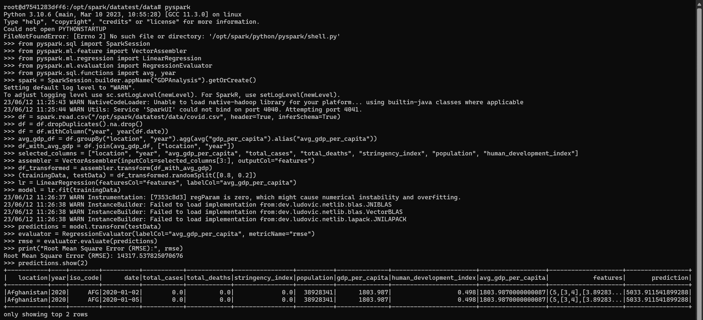
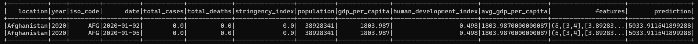
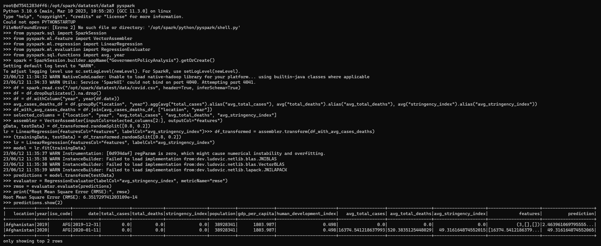
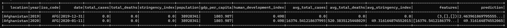
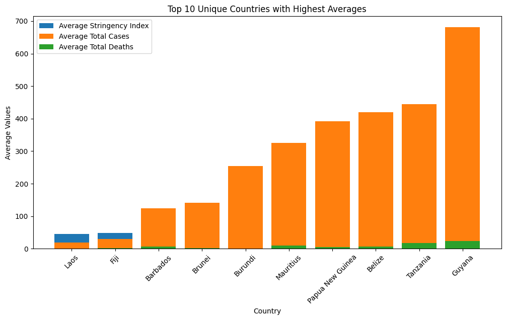
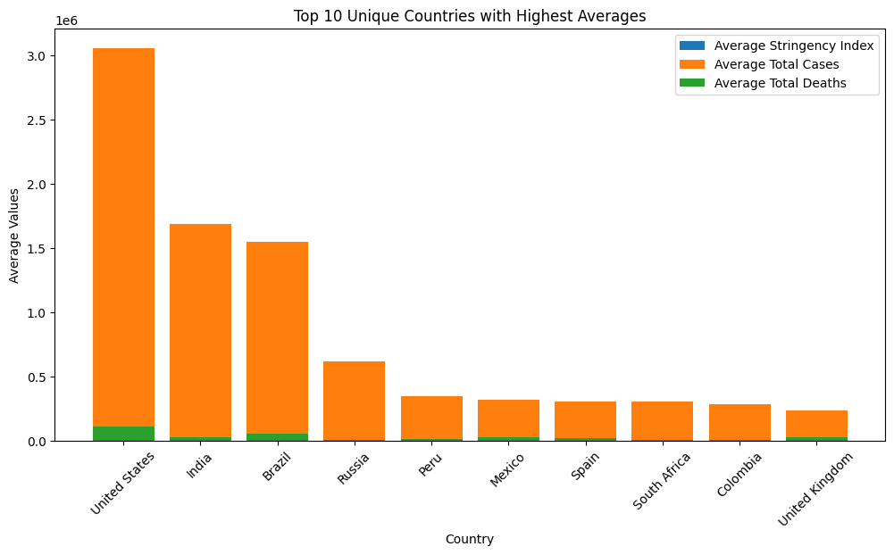
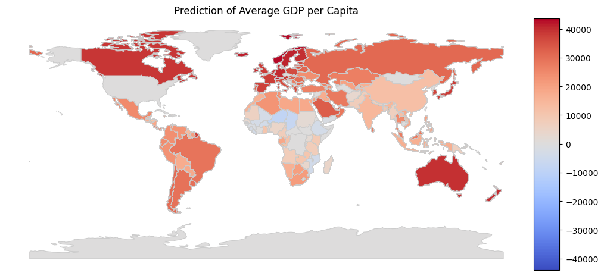
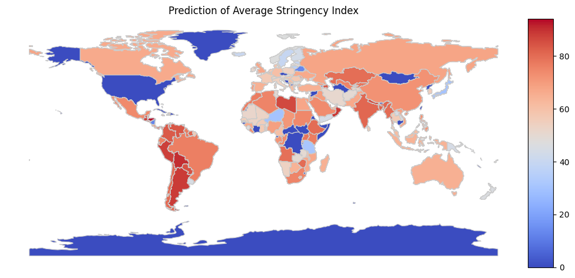
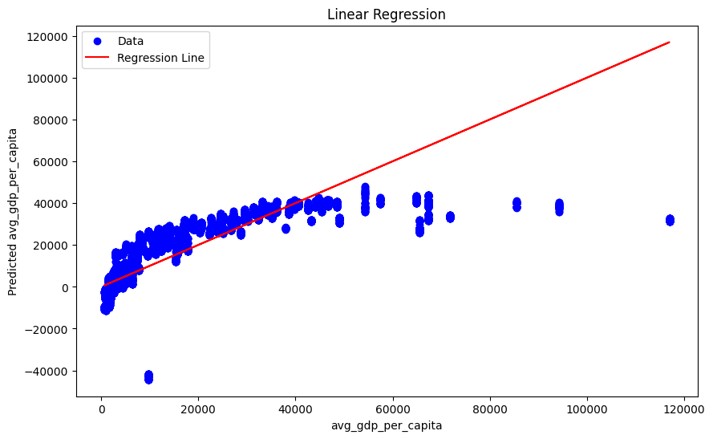
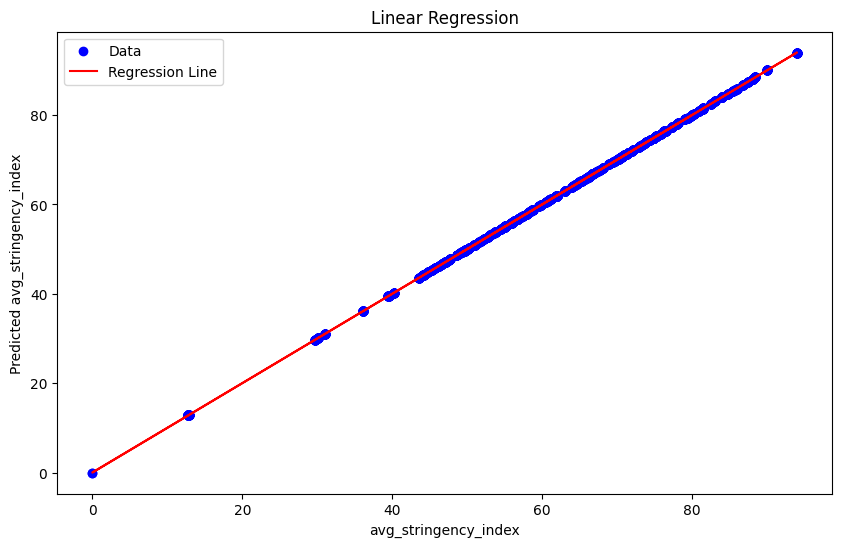

# Description
  

Repository ini berisi kode yang digunakan untuk menganalisis dataset <a href="https://www.kaggle.com/datasets/shashwatwork/impact-of-covid19-pandemic-on-the-global-economy">"Impact of Covid-19 Pandemic on the Global Economy"</a>. Tujuan dari proyek ini adalah menjalankan skenario yang sebelumnya telah dibuat menggunakan Spark Machine Learning. Dataset ini mencakup data mengenai dampak pandemi Covid-19 pada ekonomi global. Data tersebut terdiri dari beberapa kolom seperti tanggal, lokasi, GDP per kapita, kasus Covid-19, kematian Covid-19, dan lain-lain.
  
Kode dalam repository ini menggunakan PySpark untuk memproses dan menganalisis data. Beberapa langkah yang dilakukan meliputi pengolahan data, perhitungan rata-rata GDP per kapita untuk setiap lokasi dan tahun, transformasi data menggunakan VectorAssembler, pembagian data menjadi training dan testing set, penerapan Linear Regression, evaluasi model menggunakan metrik RMSE (Root Mean Square Error), serta visualisasi hasil dalam bentuk grafik batang.
  
Salah satu hasil akhir dari analisis ini adalah menampilkan 10 negara unik dengan rata-rata GDP per kapita tertinggi menggunakan grafik batang. Selain itu, kode ini juga mencakup evaluasi model berdasarkan RMSE untuk memahami sejauh mana model dapat memprediksi rata-rata indeks kelonggaran (stringency index) berdasarkan kasus total Covid-19 dan kematian total Covid-19. Proyek ini memberikan pemahaman tentang bagaimana pandemi Covid-19 memengaruhi ekonomi global dan memanfaatkan Spark Machine Learning untuk melakukan analisis data yang relevan.

# Scenario 1 Bar Graph
  

Pada skenario ini, dilakukan analisis mengenai rata-rata GDP per kapita pada setiap negara selama pandemi Covid-19. Tujuannya adalah untuk memahami dampak pandemi Covid-19 terhadap perekonomian dan kesejahteraan masyarakat di berbagai negara. kode di bawah mengimplementasikan algoritma machine learning supervised menggunakan Spark untuk menganalisis dataset "covid.csv". Proses dimulai dengan membaca dataset menggunakan SparkSession dan mengubahnya menjadi DataFrame. Selanjutnya, dilakukan pra-pemrosesan data dengan menghapus duplikat dan data yang bernilai null. Kolom "year" juga ditambahkan ke DataFrame dengan mengekstrak tahun dari kolom "date".
  
Selanjutnya, dilakukan penghitungan rata-rata GDP per kapita untuk setiap lokasi dan tahun menggunakan fungsi agregasi pada DataFrame. Hasilnya digabungkan kembali dengan DataFrame awal sehingga setiap baris memiliki nilai rata-rata GDP per kapita yang sesuai dengan lokasi dan tahunnya. Fitur-fitur yang akan digunakan dalam model regresi linear, yaitu "total_cases", "total_deaths", "stringency_index", "population", dan "human_development_index", diubah menjadi vektor menggunakan VectorAssembler.
  
Data yang telah diolah kemudian dibagi menjadi training set dan testing set dengan perbandingan 80:20. Model regresi linear dilatih menggunakan training set, dan prediksi dilakukan pada testing set. Untuk mengukur kinerja model, digunakan metrik RMSE (Root Mean Square Error) dengan membandingkan nilai rata-rata GDP per kapita yang diprediksi dengan nilai sebenarnya pada testing set.
  
Selain itu, hasil analisis divisualisasikan dalam bentuk grafik batang menggunakan library Matplotlib. Grafik tersebut menampilkan 10 negara unik dengan rata-rata GDP per kapita tertinggi, memberikan informasi visual mengenai negara-negara tersebut. Keseluruhan kode ini memanfaatkan Spark Machine Learning untuk melakukan analisis data, melatih model regresi linear, dan menghasilkan visualisasi yang relevan dalam konteks supervised machine learning.

  <pre>
    <code>
from pyspark.sql import SparkSession
from pyspark.ml.feature import VectorAssembler
from pyspark.ml.regression import LinearRegression
from pyspark.ml.evaluation import RegressionEvaluator
from pyspark.sql.functions import avg, year
from pyspark.sql.functions import desc
import matplotlib.pyplot as plt
spark = SparkSession.builder.appName("GDPAnalysis").getOrCreate()
df = spark.read.csv("/covid.csv", header=True, inferSchema=True)
df = df.dropDuplicates().na.drop()
df = df.withColumn("year", year(df.date))
avg_gdp_df = df.groupBy("location", "year").agg(avg("gdp_per_capita").alias("avg_gdp_per_capita"))
df_with_avg_gdp = df.join(avg_gdp_df, ["location", "year"])
selected_columns = ["location", "year", "avg_gdp_per_capita", "total_cases", "total_deaths", "stringency_index", "population", "human_development_index"]
assembler = VectorAssembler(inputCols=selected_columns[3:], outputCol="features")
df_transformed = assembler.transform(df_with_avg_gdp)
(trainingData, testData) = df_transformed.randomSplit([0.8, 0.2])
lr = LinearRegression(featuresCol="features", labelCol="avg_gdp_per_capita")
model = lr.fit(trainingData)
predictions = model.transform(testData)
evaluator = RegressionEvaluator(labelCol="avg_gdp_per_capita", metricName="rmse")
rmse = evaluator.evaluate(predictions)
print("Root Mean Square Error (RMSE):", rmse)
top_10_countries = df_with_avg_gdp.select("location", "avg_gdp_per_capita") \
  .dropDuplicates(["location"]) \
  .orderBy("avg_gdp_per_capita", ascending=True) \
  .limit(10)      
top_10_countries_pd = top_10_countries.toPandas()
plt.figure(figsize=(10, 6))
plt.bar(top_10_countries_pd["location"], top_10_countries_pd["avg_gdp_per_capita"])
plt.xlabel("Country")
plt.ylabel("Average GDP per Capita")
plt.title("Top 10 Unique Countries with Highest Average GDP per Capita")
plt.xticks(rotation=45)
plt.show()
    </code>
  </pre>

## Machine Learning Scenarios Flowchart

Flowchart ini menjelaskan cara pengolahan data yang berfokus pada skenario pertama yaitu analisa mengenai rata-rata GDP pada setiap negara pada saat pandemic COVID-19.

## Machine Learning Scenarios Implementation

## Result Machine Learning Scenarios

## Visualization Machine Learning Scenarios

# Scenario 2 Bar Graph
  

Dalam skenario ini, kode di bawah merupakan implementasi Spark Machine Learning dalam konteks analisis dataset "covid.csv" untuk membandingkan kebijakan pemerintah yang diambil di berbagai negara dalam menangani pandemi Covid-19 dan dampaknya terhadap angka kasus dan kematian. Prosesnya dimulai dengan inisialisasi sesi Spark menggunakan SparkSession, pembacaan dataset ke dalam DataFrame, dan pra-pemrosesan data untuk menghapus duplikat dan nilai yang hilang. Selanjutnya, dilakukan pengolahan data untuk menghitung rata-rata jumlah kasus, jumlah kematian, dan indeks ketaatan kebijakan (stringency index) untuk setiap lokasi dan tahun menggunakan fungsi agregasi pada DataFrame. Hasilnya digabungkan kembali dengan DataFrame asli untuk memperoleh informasi rata-rata yang sesuai dengan lokasi dan tahunnya. Fitur-fitur yang relevan diubah menjadi vektor menggunakan VectorAssembler.
  
Data yang telah diolah kemudian dibagi menjadi training set dan testing set dengan perbandingan 80:20. Model regresi linear menggunakan LinearRegression dari PySpark diinisialisasi, dilatih menggunakan training set, dan digunakan untuk memprediksi nilai rata-rata indeks ketaatan kebijakan pada testing set. Kinerja model dievaluasi menggunakan metrik RMSE (Root Mean Square Error) dengan membandingkan nilai prediksi dengan nilai sebenarnya pada testing set.
  
Selain itu, hasil analisis divisualisasikan dalam bentuk grafik batang menggunakan library Matplotlib. Grafik tersebut menampilkan 10 negara unik dengan rata-rata indeks ketaatan kebijakan tertinggi, rata-rata jumlah kasus tertinggi, dan rata-rata jumlah kematian tertinggi. Hal ini memberikan informasi visual mengenai negara-negara dengan tingkat ketaatan kebijakan, jumlah kasus, dan jumlah kematian yang lebih tinggi. Keseluruhan kode ini menjelaskan implementasi Spark Machine Learning dalam analisis kebijakan pemerintah selama pandemi Covid-19 dengan melibatkan proses data, pelatihan model regresi linear, evaluasi model, dan visualisasi hasil analisis.

  <pre>
    <code>
from pyspark.sql import SparkSession
from pyspark.ml.feature import VectorAssembler
from pyspark.ml.regression import LinearRegression
from pyspark.ml.evaluation import RegressionEvaluator
from pyspark.sql.functions import avg, year
from pyspark.sql.functions import desc
import matplotlib.pyplot as plt
spark = SparkSession.builder.appName("GovernmentPolicyAnalysis").getOrCreate()
df = spark.read.csv("/covid.csv", header=True, inferSchema=True)
df = df.dropDuplicates().na.drop()
df = df.withColumn("year", year(df.date))
avg_cases_deaths_df = df.groupBy("location", "year").agg(avg("total_cases").alias("avg_total_cases"), avg("total_deaths").alias("avg_total_deaths"), avg("stringency_index").alias("avg_stringency_index"))
df_with_avg_cases_deaths = df.join(avg_cases_deaths_df, ["location", "year"])
selected_columns = ["location", "year", "avg_total_cases", "avg_total_deaths", "avg_stringency_index"]
assembler = VectorAssembler(inputCols=selected_columns[2:], outputCol="features")
df_transformed = assembler.transform(df_with_avg_cases_deaths)
(trainingData, testData) = df_transformed.randomSplit([0.8, 0.2])
lr = LinearRegression(featuresCol="features", labelCol="avg_stringency_index")
model = lr.fit(trainingData)
predictions = model.transform(testData)
evaluator = RegressionEvaluator(labelCol="avg_stringency_index", metricName="rmse")
rmse = evaluator.evaluate(predictions)
print("Root Mean Square Error (RMSE):", rmse)
top_10_countries = df_with_avg_cases_deaths.select("location", "avg_stringency_index", "avg_total_cases", "avg_total_deaths") \
    .dropDuplicates(["location"]) \
    .orderBy("avg_total_cases", ascending=False) \
    .limit(10)
top_10_countries_pd = top_10_countries.toPandas()
fig, ax = plt.subplots(figsize=(12, 6))
ax.bar(top_10_countries_pd["location"], top_10_countries_pd["avg_stringency_index"], label="Average Stringency Index")
ax.bar(top_10_countries_pd["location"], top_10_countries_pd["avg_total_cases"], label="Average Total Cases")
ax.bar(top_10_countries_pd["location"], top_10_countries_pd["avg_total_deaths"], label="Average Total Deaths")
ax.set_xlabel("Country")
ax.set_ylabel("Average Values")
ax.set_title("Top 10 Unique Countries with Highest Averages")
ax.legend()
plt.xticks(rotation=45)
plt.show()
    </code>
  </pre>

## Machine Learning Scenarios Flowchart

Flowchart ini menjelaskan cara pengolahan data yang berfokus pada skenario kedua yaitu analisa mengenai perbandingan kebijakan pemerintah dan dampaknya yang bisa digunakan untuk membandingkan kebijakan pemerintah yang diambil di berbagai negara untuk menghadapi pandemic COVID-19, dan dampaknya terhadap angka kasus dan kematian. 

## Machine Learning Scenarios Implementation

## Result Machine Learning Scenarios

## Visualization Machine Learning Scenarios

# Scenario 1 Geography
  

kode di bawah merupakan contoh implementasi Spark dalam melakukan analisis regresi linear pada data COVID-19 yang diambil dari file CSV. Dalam langkah-langkahnya, pertama-tama, sesi Spark dibangun dengan nama aplikasi "GDPAnalysis". Kemudian, data COVID-19 dibaca ke dalam dataframe Spark, dan dilakukan pembersihan data dengan menghapus duplikasi dan nilai null. Selanjutnya, kolom "year" ditambahkan untuk menyimpan informasi tahun dari kolom "date".
  
Setelah itu, dilakukan perhitungan rata-rata GDP per kapita berdasarkan lokasi dan tahun, dan dataframe dengan rata-rata GDP per kapita digabungkan dengan dataframe asli berdasarkan lokasi dan tahun. Langkah selanjutnya adalah memilih kolom-kolom yang akan digunakan sebagai fitur dalam model regresi linear. Fitur-fitur tersebut kemudian digabungkan menggunakan VectorAssembler. Data dibagi menjadi trainingData dan testData dengan perbandingan 80:20, dan model regresi linear dibentuk dengan menggunakan fitur "features" dan label "avg_gdp_per_capita".
  
Model tersebut dilatih menggunakan trainingData, dan kemudian dilakukan prediksi terhadap testData. Untuk mengevaluasi model, digunakan evaluator RegressionEvaluator untuk menghitung nilai RMSE (Root Mean Square Error) dari prediksi. Hasil prediksi diubah menjadi Pandas DataFrame untuk kemudahan pemrosesan. Selanjutnya, data peta dunia dibaca menggunakan geopandas, dan data prediksi digabungkan dengan data peta dunia berdasarkan nama negara. Nilai prediksi yang kosong diisi dengan 0. Terakhir, dilakukan visualisasi prediksi GDP per kapita dalam bentuk peta menggunakan matplotlib.
  
Dengan menggunakan Spark dan regresi linear, analisis ini memungkinkan kita untuk menganalisis hubungan antara fitur-fitur seperti total kasus COVID-19, total kematian, indeks ketatnya kebijakan, populasi, dan indeks pembangunan manusia terhadap rata-rata GDP per kapita negara. Melalui visualisasi peta, kita dapat memperoleh pemahaman yang lebih baik tentang pola dan hubungan yang mungkin ada di antara negara-negara tersebut.

  <pre>
    <code>
from pyspark.sql import SparkSession
from pyspark.ml.feature import VectorAssembler
from pyspark.ml.regression import LinearRegression
from pyspark.ml.evaluation import RegressionEvaluator
from pyspark.sql.functions import avg, year
from pyspark.sql.functions import desc
import matplotlib.pyplot as plt
import geopandas as gpd
from mpl_toolkits.axes_grid1 import make_axes_locatable
spark = SparkSession.builder.appName("GDPAnalysis").getOrCreate()
df = spark.read.csv("/content/covid.csv", header=True, inferSchema=True)
df = df.dropDuplicates().na.drop()
df = df.withColumn("year", year(df.date))
avg_gdp_df = df.groupBy("location", "year").agg(avg("gdp_per_capita").alias("avg_gdp_per_capita"))
df_with_avg_gdp = df.join(avg_gdp_df, ["location", "year"])
selected_columns = ["location", "year", "avg_gdp_per_capita", "total_cases", "total_deaths", "stringency_index", "population", "human_development_index"]
assembler = VectorAssembler(inputCols=selected_columns[3:], outputCol="features")
df_transformed = assembler.transform(df_with_avg_gdp)
(trainingData, testData) = df_transformed.randomSplit([0.8, 0.2])
lr = LinearRegression(featuresCol="features", labelCol="avg_gdp_per_capita")
model = lr.fit(trainingData)
predictions = model.transform(testData)
evaluator = RegressionEvaluator(labelCol="avg_gdp_per_capita", metricName="rmse")
rmse = evaluator.evaluate(predictions)
predictions_pd = predictions.toPandas()
world_map = gpd.read_file(gpd.datasets.get_path("naturalearth_lowres"))
merged_data = world_map.merge(predictions_pd, left_on="name", right_on="location", how="left")
merged_data["prediction"] = merged_data["prediction"].fillna(0)
fig, ax = plt.subplots(figsize=(12, 8))
divider = make_axes_locatable(ax)
cax = divider.append_axes("right", size="5%", pad=0.1)
merged_data.plot(column="prediction", cmap="coolwarm", linewidth=0.8, ax=ax, edgecolor="0.8", legend=True, cax=cax)
ax.set_title("Prediction of Average GDP per Capita")
ax.axis("off")
plt.show()
    </code>
  </pre>

## Scenarios Geography

# Scenario 2 Geography
  

kode di bawah merupakan contoh penggunaan Spark dalam melakukan analisis machine learning berbasis regresi linear pada data COVID-19. Tujuan utama dari analisis ini adalah untuk memprediksi rata-rata indeks ketatnya kebijakan (avg_stringency_index) berdasarkan fitur-fitur lainnya seperti total kasus COVID-19 (avg_total_cases) dan total kematian (avg_total_deaths).
  
Dalam kode tersebut, langkah pertama yang dilakukan adalah membangun sesi Spark dengan nama aplikasi "GovernmentPolicyAnalysis". Kemudian, data COVID-19 dibaca dari file CSV ke dalam dataframe Spark. Dilakukan pembersihan data dengan menghapus duplikasi dan nilai null. Selain itu, juga ditambahkan kolom "year" yang berisi tahun dari kolom "date" untuk memudahkan analisis berdasarkan periode waktu.
  
Selanjutnya, dilakukan perhitungan rata-rata total kasus, total kematian, dan indeks ketatnya kebijakan berdasarkan lokasi dan tahun menggunakan fungsi agregasi avg(). Hasil perhitungan ini kemudian digabungkan dengan dataframe asli berdasarkan lokasi dan tahun. Setelah itu, langkah berikutnya adalah memilih kolom-kolom yang akan digunakan sebagai fitur dalam model regresi linear. Fitur-fitur tersebut kemudian digabungkan menggunakan VectorAssembler untuk membentuk fitur input pada model. Data kemudian dibagi menjadi trainingData dan testData dengan perbandingan 80:20.
  
Selanjutnya, dibentuk model LinearRegression dengan menggunakan fitur "features" sebagai input dan label "avg_stringency_index" sebagai target. Model ini dilatih menggunakan trainingData, dan dilakukan prediksi terhadap testData. Untuk evaluasi kinerja model, digunakan evaluator RegressionEvaluator yang menghitung nilai RMSE (Root Mean Square Error) dari prediksi. Hasil prediksi diubah menjadi Pandas DataFrame untuk mempermudah pemrosesan dan analisis selanjutnya. Kemudian, dilakukan pembacaan data peta dunia menggunakan geopandas. Data prediksi yang telah diperoleh digabungkan dengan data peta dunia berdasarkan nama negara. Untuk nilai prediksi yang kosong, diisi dengan 0 agar visualisasi peta tetap lengkap.
  
Terakhir, hasil prediksi yang telah terintegrasi dengan data peta dunia divisualisasikan dalam bentuk peta menggunakan matplotlib. Peta tersebut memperlihatkan prediksi rata-rata indeks ketatnya kebijakan pada setiap negara, dengan perbedaan warna yang menggambarkan tingkat stringency yang berbeda. Dengan demikian, analisis ini dapat memberikan pemahaman lebih baik tentang pola dan hubungan antara fitur-fitur yang ada di antara negara-negara yang terdampak pandemi COVID-19.

  <pre>
    <code>
from pyspark.sql import SparkSession
from pyspark.ml.feature import VectorAssembler
from pyspark.ml.regression import LinearRegression
from pyspark.ml.evaluation import RegressionEvaluator
from pyspark.sql.functions import avg, year
from pyspark.sql.functions import desc
import matplotlib.pyplot as plt
import geopandas as gpd
from mpl_toolkits.axes_grid1 import make_axes_locatable
spark = SparkSession.builder.appName("GDPAnalysis").getOrCreate()
df = spark.read.csv("/content/covid.csv", header=True, inferSchema=True)
df = df.dropDuplicates().na.drop()
df = df.withColumn("year", year(df.date))
avg_gdp_df = df.groupBy("location", "year").agg(avg("gdp_per_capita").alias("avg_gdp_per_capita"))
df_with_avg_gdp = df.join(avg_gdp_df, ["location", "year"])
selected_columns = ["location", "year", "avg_gdp_per_capita", "total_cases", "total_deaths", "stringency_index", "population", "human_development_index"]
assembler = VectorAssembler(inputCols=selected_columns[3:], outputCol="features")
df_transformed = assembler.transform(df_with_avg_gdp)
(trainingData, testData) = df_transformed.randomSplit([0.8, 0.2])
lr = LinearRegression(featuresCol="features", labelCol="avg_gdp_per_capita")
model = lr.fit(trainingData)
predictions = model.transform(testData)
evaluator = RegressionEvaluator(labelCol="avg_gdp_per_capita", metricName="rmse")
rmse = evaluator.evaluate(predictions)
predictions_pd = predictions.toPandas()
world_map = gpd.read_file(gpd.datasets.get_path("naturalearth_lowres"))
merged_data = world_map.merge(predictions_pd, left_on="name", right_on="location", how="left")
merged_data["prediction"] = merged_data["prediction"].fillna(0)
fig, ax = plt.subplots(figsize=(12, 8))
divider = make_axes_locatable(ax)
cax = divider.append_axes("right", size="5%", pad=0.1)
merged_data.plot(column="prediction", cmap="coolwarm", linewidth=0.8, ax=ax, edgecolor="0.8", legend=True, cax=cax)
ax.set_title("Prediction of Average GDP per Capita")
ax.axis("off")
plt.show()
    </code>
  </pre>

## Scenarios Geography

# Scenario 1 Linear Regression
  

Spark untuk melakukan analisis machine learning berbasis regresi linear pada data COVID-19 dengan tujuan memprediksi rata-rata GDP per kapita negara. Langkah-langkahnya dimulai dengan membangun sesi Spark dan membaca data COVID-19 dari file CSV ke dalam dataframe Spark. Setelah itu, dilakukan pembersihan data dengan menghapus duplikasi dan nilai null, serta ditambahkan kolom "year" untuk mempermudah analisis berdasarkan tahun.
  
Selanjutnya, dilakukan perhitungan rata-rata GDP per kapita berdasarkan lokasi dan tahun menggunakan fungsi agregasi avg(). Dataframe hasil agregasi ini digabungkan dengan dataframe asli berdasarkan lokasi dan tahun. Setelah itu, dipilih kolom-kolom yang akan digunakan sebagai fitur dalam model regresi linear, seperti total kasus COVID-19, total kematian, indeks ketatnya kebijakan, populasi, dan indeks pembangunan manusia.
  
Data kemudian dibagi menjadi trainingData dan testData dengan perbandingan 80:20. Model LinearRegression dibentuk dengan menggunakan fitur-fitur sebagai input dan rata-rata GDP per kapita sebagai target. Model ini dilatih menggunakan trainingData, dan dilakukan prediksi terhadap testData. Untuk mengevaluasi kinerja model, digunakan evaluator RegressionEvaluator yang menghitung nilai RMSE (Root Mean Square Error) sebagai metrik evaluasi.
  
Hasil prediksi dan nilai asli rata-rata GDP per kapita diubah menjadi Pandas DataFrame untuk memudahkan pemrosesan. Terakhir, dilakukan visualisasi hasil prediksi dalam bentuk scatter plot menggunakan matplotlib. Scatter plot tersebut memperlihatkan hubungan antara nilai asli rata-rata GDP per kapita dan nilai prediksi yang dihasilkan oleh model regresi linear. Garis regresi linear ditampilkan sebagai referensi untuk melihat sejauh mana prediksi mendekati nilai asli.
  
Dengan menggunakan Spark dan teknik regresi linear, analisis ini memberikan pemahaman tentang hubungan antara fitur-fitur seperti total kasus COVID-19, total kematian, indeks ketatnya kebijakan, populasi, dan indeks pembangunan manusia terhadap rata-rata GDP per kapita negara. Melalui prediksi yang dihasilkan, kita dapat memperoleh informasi tentang faktor-faktor yang berpengaruh terhadap tingkat GDP per kapita suatu negara.

  <pre>
    <code>
from pyspark.sql import SparkSession
from pyspark.ml.feature import VectorAssembler
from pyspark.ml.regression import LinearRegression
from pyspark.ml.evaluation import RegressionEvaluator
from pyspark.sql.functions import avg, year
from pyspark.sql.functions import desc
import matplotlib.pyplot as plt
import geopandas as gpd
from mpl_toolkits.axes_grid1 import make_axes_locatable
spark = SparkSession.builder.appName("GDPAnalysis").getOrCreate()
df = spark.read.csv("/content/covid.csv", header=True, inferSchema=True)
df = df.dropDuplicates().na.drop()
df = df.withColumn("year", year(df.date))
avg_gdp_df = df.groupBy("location", "year").agg(avg("gdp_per_capita").alias("avg_gdp_per_capita"))
df_with_avg_gdp = df.join(avg_gdp_df, ["location", "year"])
selected_columns = ["location", "year", "avg_gdp_per_capita", "total_cases", "total_deaths", "stringency_index", "population", "human_development_index"]
assembler = VectorAssembler(inputCols=selected_columns[3:], outputCol="features")
df_transformed = assembler.transform(df_with_avg_gdp)
(trainingData, testData) = df_transformed.randomSplit([0.8, 0.2])
lr = LinearRegression(featuresCol="features", labelCol="avg_gdp_per_capita")
model = lr.fit(trainingData)
predictions = model.transform(testData)
evaluator = RegressionEvaluator(labelCol="avg_gdp_per_capita", metricName="rmse")
rmse = evaluator.evaluate(predictions)
predictions_pd = predictions.toPandas()
world_map = gpd.read_file(gpd.datasets.get_path("naturalearth_lowres"))
merged_data = world_map.merge(predictions_pd, left_on="name", right_on="location", how="left")
merged_data["prediction"] = merged_data["prediction"].fillna(0)
fig, ax = plt.subplots(figsize=(12, 8))
divider = make_axes_locatable(ax)
cax = divider.append_axes("right", size="5%", pad=0.1)
merged_data.plot(column="prediction", cmap="coolwarm", linewidth=0.8, ax=ax, edgecolor="0.8", legend=True, cax=cax)
ax.set_title("Prediction of Average GDP per Capita")
ax.axis("off")
plt.show()
    </code>
  </pre>

## Scenarios Linear Regression

# Scenario 2 Linear Regression
  

Spark untuk melakukan analisis machine learning berbasis regresi linear pada data COVID-19. Tujuan dari analisis ini adalah untuk memprediksi rata-rata indeks ketatnya kebijakan (avg_stringency_index) berdasarkan fitur-fitur lainnya. Pertama, dilakukan pembentukan sesi Spark dengan nama aplikasi "GovernmentPolicyAnalysis" dan pembacaan data COVID-19 dari file CSV ke dalam dataframe Spark. Selanjutnya, dilakukan pembersihan data dengan menghapus duplikasi dan nilai null. Untuk memudahkan analisis berdasarkan periode waktu, kolom "year" ditambahkan berdasarkan kolom "date".
  
Selanjutnya, dilakukan perhitungan rata-rata total kasus, total kematian, dan indeks ketatnya kebijakan berdasarkan lokasi dan tahun menggunakan fungsi agregasi avg(). Dataframe hasil agregasi ini digabungkan dengan dataframe asli berdasarkan lokasi dan tahun. Kemudian, fitur-fitur yang akan digunakan dalam model regresi linear dipilih, yaitu "avg_total_cases", "avg_total_deaths", dan "avg_stringency_index". Fitur-fitur ini digabungkan menggunakan VectorAssembler untuk membentuk fitur input pada model.
  
Data dibagi menjadi trainingData dan testData dengan perbandingan 80:20. Model LinearRegression dibentuk dengan menggunakan fitur "features" sebagai input dan rata-rata indeks ketatnya kebijakan sebagai target. Model ini dilatih menggunakan trainingData, dan kemudian dilakukan prediksi terhadap testData. Untuk evaluasi kinerja model, digunakan evaluator RegressionEvaluator yang menghitung nilai RMSE (Root Mean Square Error) sebagai metrik evaluasi. Hasil prediksi dan nilai asli rata-rata indeks ketatnya kebijakan diubah menjadi Pandas DataFrame untuk kemudahan pemrosesan. Terakhir, hasil prediksi dan nilai asli ditampilkan dalam scatter plot menggunakan matplotlib, di mana hubungan antara nilai asli dan prediksi ditampilkan dengan garis regresi linear sebagai referensi.
  
Dengan menggunakan Spark dan teknik regresi linear, analisis ini memberikan pemahaman tentang faktor-faktor seperti total kasus COVID-19 dan total kematian yang berpengaruh terhadap indeks ketatnya kebijakan. Melalui prediksi yang dihasilkan, kita dapat mengevaluasi tingkat ketatnya kebijakan berdasarkan fitur-fitur terkait COVID-19.

  <pre>
    <code>
from pyspark.sql import SparkSession
from pyspark.ml.feature import VectorAssembler
from pyspark.ml.regression import LinearRegression
from pyspark.ml.evaluation import RegressionEvaluator
from pyspark.sql.functions import avg, year
from pyspark.sql.functions import desc
import matplotlib.pyplot as plt
import geopandas as gpd
from mpl_toolkits.axes_grid1 import make_axes_locatable
spark = SparkSession.builder.appName("GDPAnalysis").getOrCreate()
df = spark.read.csv("/content/covid.csv", header=True, inferSchema=True)
df = df.dropDuplicates().na.drop()
df = df.withColumn("year", year(df.date))
avg_gdp_df = df.groupBy("location", "year").agg(avg("gdp_per_capita").alias("avg_gdp_per_capita"))
df_with_avg_gdp = df.join(avg_gdp_df, ["location", "year"])
selected_columns = ["location", "year", "avg_gdp_per_capita", "total_cases", "total_deaths", "stringency_index", "population", "human_development_index"]
assembler = VectorAssembler(inputCols=selected_columns[3:], outputCol="features")
df_transformed = assembler.transform(df_with_avg_gdp)
(trainingData, testData) = df_transformed.randomSplit([0.8, 0.2])
lr = LinearRegression(featuresCol="features", labelCol="avg_gdp_per_capita")
model = lr.fit(trainingData)
predictions = model.transform(testData)
evaluator = RegressionEvaluator(labelCol="avg_gdp_per_capita", metricName="rmse")
rmse = evaluator.evaluate(predictions)
predictions_pd = predictions.toPandas()
world_map = gpd.read_file(gpd.datasets.get_path("naturalearth_lowres"))
merged_data = world_map.merge(predictions_pd, left_on="name", right_on="location", how="left")
merged_data["prediction"] = merged_data["prediction"].fillna(0)
fig, ax = plt.subplots(figsize=(12, 8))
divider = make_axes_locatable(ax)
cax = divider.append_axes("right", size="5%", pad=0.1)
merged_data.plot(column="prediction", cmap="coolwarm", linewidth=0.8, ax=ax, edgecolor="0.8", legend=True, cax=cax)
ax.set_title("Prediction of Average GDP per Capita")
ax.axis("off")
plt.show()
    </code>
  </pre>

## Scenarios Linear Regression

## Team
* [@R M Azmi Herdi S](https://github.com/2azmi2)
* [@Ramona Andhani](https://github.com/ramonaandhani17)

